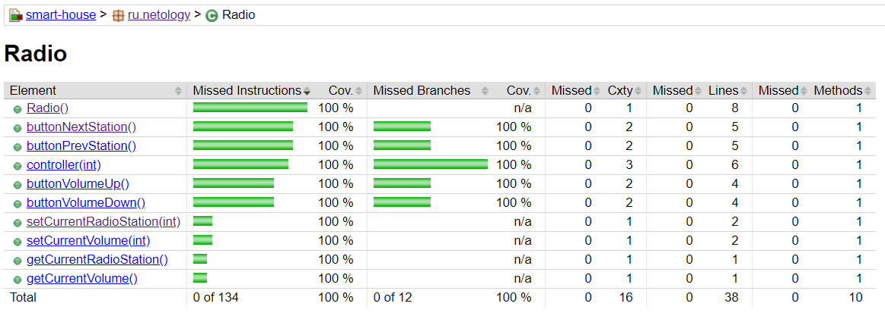

# Цикломатическая сложность кода (Cyclomatic Complexity)
JaCoCo вычисляет цикломатическую сложность для каждого неабстрактного метода и суммирует сложность для классов, пакетов и групп. Согласно определению McCabe1996 цикломатическая сложность - это минимальное количество путей, которые в (линейной) комбинации могут генерировать все возможные пути через метод. Таким образом, значение сложности может служить индикатором количества случаев модульного тестирования, чтобы полностью охватить определенную часть программного обеспечения. Показатели сложности всегда можно рассчитать даже при отсутствии отладочной информации в файлах классов.

Формальное определение цикломатической сложности v(G) основано на представлении графа потока управления метода в виде ориентированного графа:

<pre>v(G) = E - N + 2 </pre>

Где E - количество ребер, а N - количество узлов. JaCoCo вычисляет цикломатическую сложность метода с помощью следующего эквивалентного уравнения на основе количества ветвей (B) и количества точек принятия решения (D):

<pre>v(G) = B - D + 1</pre>

На основе состояния покрытия каждой ветви JaCoCo также рассчитывает покрытую и пропущенную сложность для каждого метода. Опять пропущенная сложность является показателем количества пропущенных тестовых примеров для полного охвата модуля. JaCoCo не учитывает обработку исключений, поскольку блоки try / catch ветвей также не увеличивают сложность.

Источник: https://www.eclemma.org/jacoco/trunk/doc/counters.html

# Итоги работы

Jacoco автоматически рассчитывает показатель сложности кода и включает в отчет о проведенных тестах. Данные отображаются в колонке Cxty отчета.
Согласно отчету Jacoco, для каждого из двух методов buttonNextStation() и buttonPrevStation() цикломатическая сложность равна 2. Выполнено необходимое количество тестов для каждого метода. 

